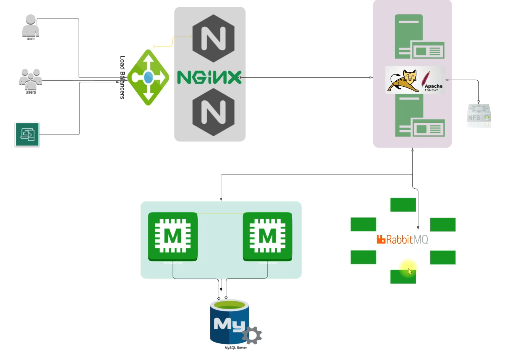
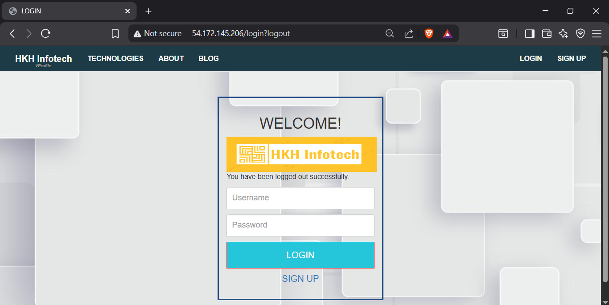
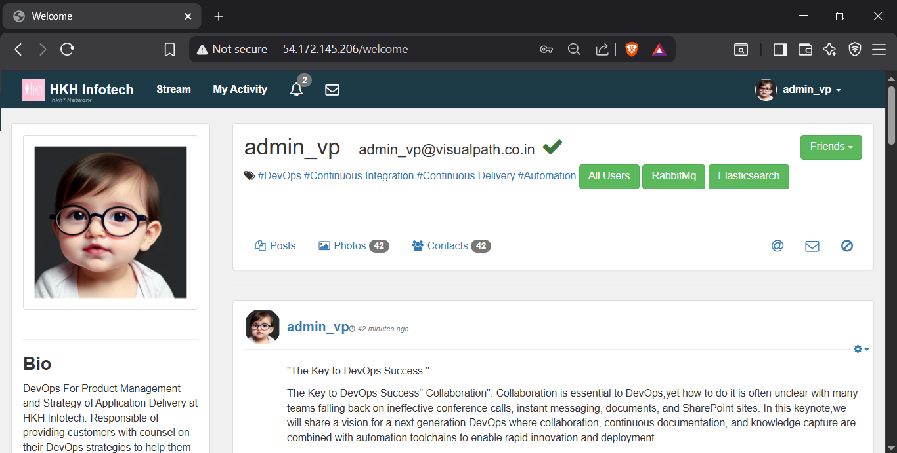
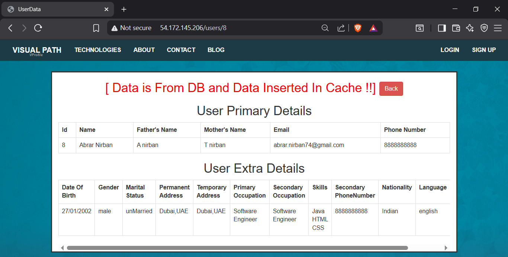
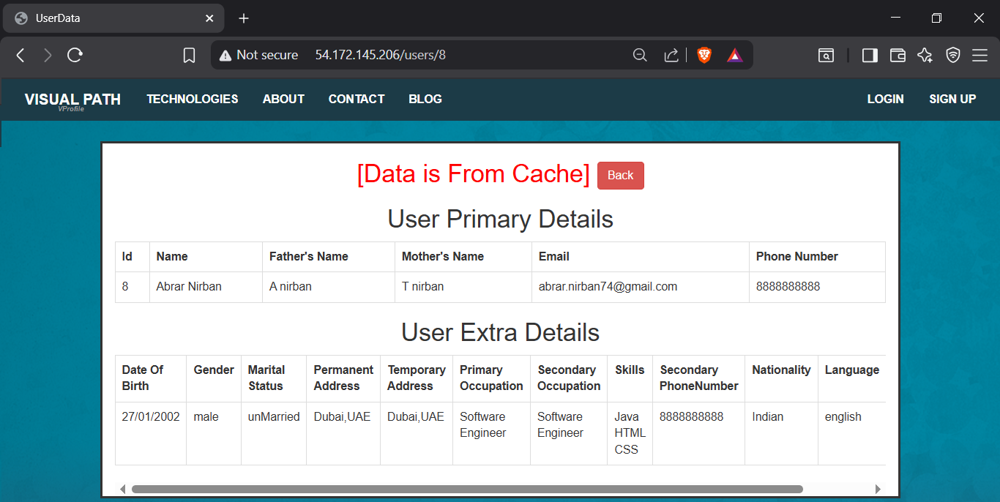
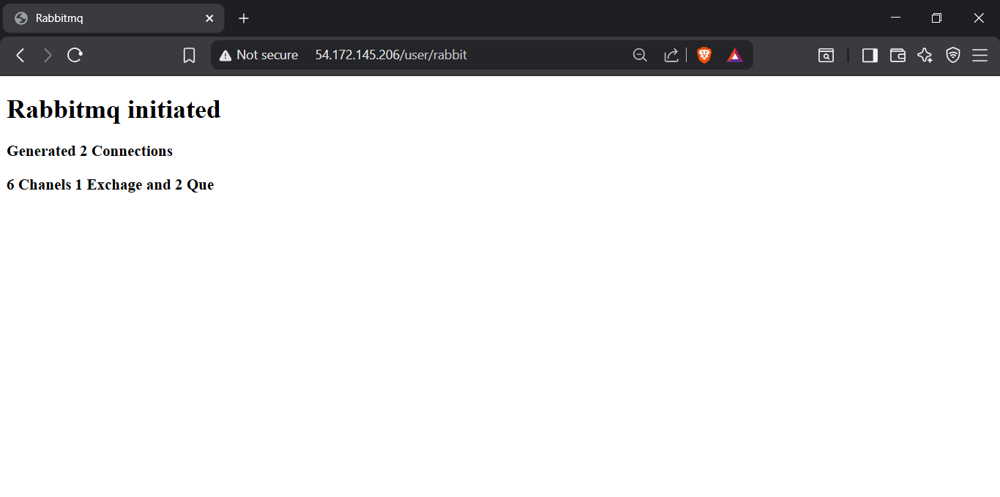

# VProfile Local Provisioning (Vagrant + Bash + VirtualBox)


A fully reproducible local multi-VM DevOps environment for the VProfile application.
This setup uses Vagrant, VirtualBox, and Bash provisioning scripts to automate the creation and configuration of all application tiers.

This project recreates a complete multi-tier architecture entirely on your local machine—no cloud, no external services.

---

## 📌 Project Overview
```
The VProfile application is a multi-tier Java web application composed of:

| Tier                |   Technology            |
| --------------      | ----------------------- |
| Web Tier            |   Nginx (reverse proxy) |
| App Tier            |   Tomcat 9              |
| Cache Tier          |   Memcached             |
| Message Broker      |   RabbitMQ              |
| Database            |   MySQL / MariaDB       |
```
This repository includes:

* Architecture diagrams
* Manual setup procedures for each VM
* Automated provisioning using Vagrant + shell scripts
* Service configuration examples
* Sequence of provisioning (DB → Cache → MQ → App → Web)

---

## 🏗️ Architecture



---

## 📁 Repository Structure
```
vprofile-local-provisioning/
│
├── architecture/
│   ├── diagrams/
│   └── infra-overview.md
│
├── manual-setup/
│   ├── 01-mysql-setup.md
│   ├── 02-memcache-setup.md
│   ├── 03-rabbitmq-setup.md
│   ├── 04-tomcat-setup.md
│   ├── 05-nginx-setup.md
│   ├── code-build-deploy.md
│   └── troubleshooting.md
│
├── automated-setup/
│   ├── Vagrantfile
│   ├── provisioning/
│   │   ├── mysql.sh
│   │   ├── memcache.sh
│   │   ├── rabbitmq.sh
│   │   ├── tomcat.sh
│   │   ├── nginx.sh
│   │   └── common.sh
│   └── README.md
│
├── docs/
│   ├── port-mapping.md
│   ├── vm-details.md
│   ├── service-overview.md
│   ├── sequence-of-provisioning.md
│   └── screenshots/
│
└── README.md
```

---

## 🔧 Technologies Used

- Vagrant – VM orchestration
- VirtualBox – Hypervisor
- Linux (CentOS / Ubuntu) – Base OS for VMs
- MariaDB / MySQL – Database
- Memcached – Caching tier
- RabbitMQ – Message broker
- Tomcat 9 – Application server
- Nginx – Reverse proxy
- Bash – Automation scripts
- Git – Version control

---

## 🚀 Manual Provisioning Overview

### This project includes step-by-step guides for setting up:

- MySQL / MariaDB
- Memcached
- RabbitMQ
- Tomcat + Application Deployment
- Nginx Reverse Proxy


Each step is fully documented in:
```
manual-setup/
```
---

## 🤖 Automated Setup (Vagrant + Bash)

### The automated provisioning replicates all manual steps using:

* A multi-VM Vagrantfile
* Individual provisioning scripts for each service
* Automatic hosts file management
* Automatic network assignments

Run the full environment:
```
vagrant up
```
This will create and configure the following VMs:
```
db01 – Database
mc01 – Memcached
rmq01 – RabbitMQ
app01 – Tomcat application server
web01 – Nginx frontend
```
Each machine runs its own provisioning script in:
```
automated-setup/provisioning/
```
If provisioning stops or fails, simply rerun:
```
vagrant up
```

---

## 📝 Screenshots
Environment verification screenshots:
### App-Login


### App-Home


### Cache-Miss


### Cache-Hit


### Rabbitmq-Initiated


---

## 🎯 Learning Outcomes

### By completing this project, you will gain hands-on experience with:

- Local multi-VM environments
- Infrastructure provisioning
- Bash automation
- Linux service setup
- Reverse proxy configuration
- Application deployment
- Debugging multi-tier systems

### This project forms the foundation for future DevOps automation using:

* Ansible
* Terraform
* Jenkins / CI-CD
* AWS infrastructure
* Containers & Kubernetes

---

## 🙌 Contributions
This repository is part of a personal DevOps learning journey.

Feel free to fork and experiment.
